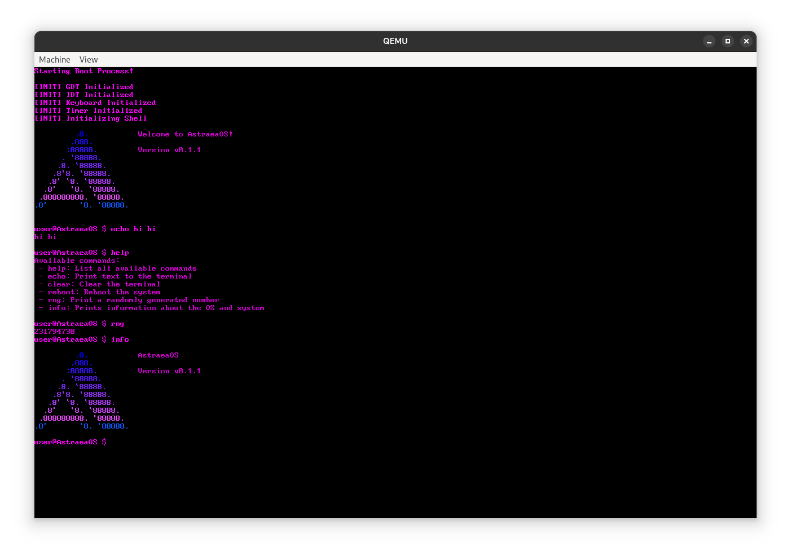

<a id="readme-top"></a>

<!-- PROJECT NAME -->
<br />
<div align="center">
  <a href="https://github.com/prolibperson/AstraeaOS">
    
  </a>

  <h3 align="center">AstraeaOS</h3>
  <p align="center">
    An x86_64 operating system.
  </p>
</div>

<!-- TABLE OF CONTENTS -->
<details>
  <summary>Table of Contents</summary>
  <ol>
    <li>
      <a href="#about-the-project">About The Project</a>
    </li>
    <li>
      <ul>
        <li><a href="#building">Building</a></li>
        <li><a href="#running">Running</a></li>
      </ul>
    </li>
    <li><a href="#roadmap">Roadmap</a></li>
    <li><a href="#contact">Contact</a></li>
    <li><a href="#acknowledgments">Acknowledgments</a></li>
  </ol>
</details>


<!-- ABOUT THE PROJECT -->
## About The Project

OS Dev and low level learning project.


<!-- GETTING STARTED -->

### Building

1. Set up an x86_64 Cross compiler [https://wiki.osdev.org/GCC_Cross-Compiler](https://wiki.osdev.org/GCC_Cross-Compiler)
2. Run "make release" or "make debug" in the root directory of the project
   ```sh
   make release
   ```

   ```sh
   make debug
   ```


<!-- USAGE EXAMPLES -->
## Running

- Using QEMU
1. Run "make qemu-debug" or "make qemu-release" in the root directory of the project
   ```sh
   make qemu-debug
   ```
   ```sh
   make qemu-release
   ```

- If you dont wanna use QEMU
1. Grab an iso in the isobuilds folder and run with whatever VM you want!


<!-- ROADMAP -->
## Roadmap

- [x] Set up interrupts, an IDT and a GDT
- [x] Add keyboard support
- [x] Move to 64-bit
- [x] Switch to Limine
- [x] Move away from VGA Text Mode
- [x] Add Shell
- [ ] FAT-32 Filesystem
- [ ] Add Custom Bootloader
- [ ] TCP/IP Stack


<!-- CONTACT -->
## Contact

prolib - [@prolibperson](https://twitter.com/prolibperson) - prolib69420@gmail.com

Project Link: [https://github.com/prolibperson/AstraeaOS](https://github.com/prolibperson/AstraeaOS)


<!-- ACKNOWLEDGMENTS -->
## Acknowledgments

* [OSDev Wiki](https://wiki.osdev.org/)

## License

This project is licensed under the [GNU GENERAL PUBLIC LICENSE v3 (GPLv3)](https://github.com/prolibperson/AstraeaOS/blob/main/LICENSE)